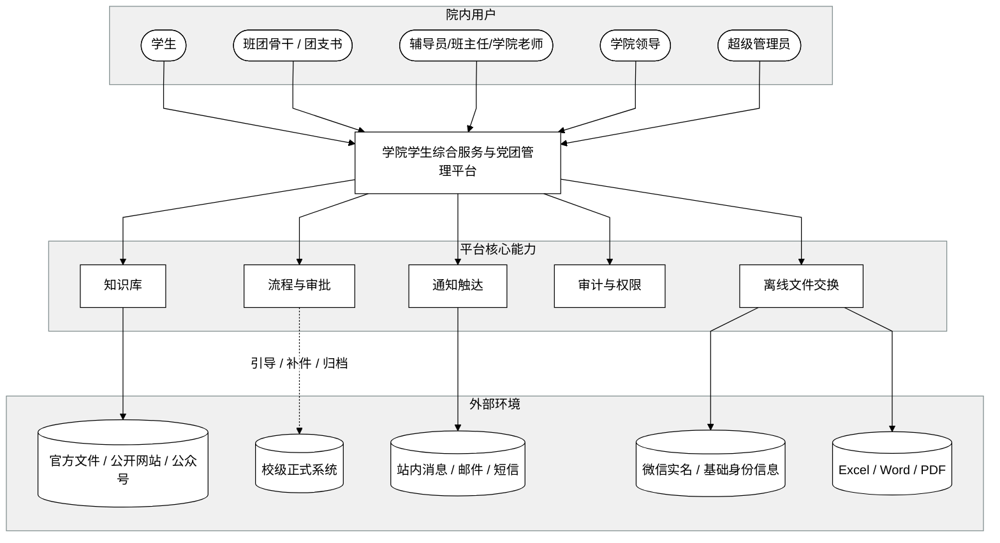

## Software Glance: 信息学院学生综合服务与党团管理平台

### Description
该平台是一个面向信息学院的学院级学生事务入口，用于承载政策咨询、受控智能问答、常见事务申请、党团流程跟踪、通知触达、电子证明生成、学业分析与基础统计。学生主要通过手机端完成查询、申请、理论自测和状态查看，老师与管理员主要通过网页端完成审批、维护、统计和导入导出。平台不直接依赖校级“微人大”接口，而是通过学院侧维护的知识内容、结构化数据和文件交换能力保持业务运行。它与官方公开信息源、学院基础数据和站内消息 / 邮件 / 短信等消息渠道协作，同时将敏感数据控制、操作留痕和边界提示作为系统骨架能力。

### System Diagram

### System Boundary

**Actors:**
- 学生：查询政策、下载模板、使用受控智能问答、提交申请、查看党团进度与通知、参加理论自测、查看本人学业风险提示与课程建议。
- 班团骨干 / 团支书：在职责范围内查看组织或班级层面的流程与记录，协助执行提醒与汇总。
- 辅导员 / 班主任 / 学院老师：审批材料、维护知识内容、处理通知、查看统计与工作台账。
- 学院领导：查看汇总结果、处理关键审批、掌握执行情况。
- 超级管理员：管理角色权限、模板、标签、知识内容、流程配置与日志。

**External Systems:**
- 微信实名 / 基础身份信息：用于账号与学生基本身份绑定，并作为受控身份数据交换与核验依据。
- 官方文件 / 公开网站 / 公众号：作为政策、通知与标准答案来源。
- Excel / Word / PDF 文件：学院侧的主数据、模板与外部交换介质。
- 校级正式系统：某些正式事务的生效链路仍在校级系统中，学院平台只做引导、补件或归档。
- 站内消息 / 邮件 / 短信：承载消息触达，短信可由部署配置和预算控制启用。

### High-Level Components
- **学生服务入口**：承载学生侧查询、申请、状态查看与消息接收。
- **管理与审批工作台**：承载老师、领导、管理员的审批、维护与统计操作。
- **知识与模板中心**：沉淀政策条目、标准答案、受控 AI 匹配依据、文件来源与模板资料。
- **事务与党团流程中心**：承载常见事务申请、流转状态、党团阶段、节点提醒与理论自测。
- **通知与画像分发中心**：管理通知内容、官方来源汇聚、标签、目标人群与发送记录。
- **数据交换与台账维护**：处理 Excel/Word/PDF 的导入导出、学生主数据和规则数据维护。
- **权限与审计中心**：控制角色权限、字段可见性、导出限制与操作留痕。
- **统计与学业风险视图**：输出工作量、办理进度、通知触达、学业风险提示与课程类型级建议。

注：系统上下文图只绘制技术拆解主线所依赖的五个核心闭环；受控 AI 匹配、理论自测、官方通知汇聚、证明 PDF 预览、学业课程建议等专项能力分别挂接在相应闭环内，在文字说明中展开，不在该图中额外拆成独立方块。

注：该图中的箭头主要表示能力依赖、协作边界或对外连接关系，并不严格等同于权威数据的单向流向；例如“官方文件 / 公开网站 / 公众号”仍然是知识内容来源，“校级正式系统”仍然是正式生效边界，具体语义以本节正文说明为准。

### Interfaces

| Interface | Type | Connected To | Purpose |
|-----------|------|--------------|---------|
| 学生端入口 | Web / Mini Program | 学生 | 提供查询、申请、状态查看与消息中心 |
| 管理端工作台 | Web | 老师 / 领导 / 管理员 / 班团骨干 | 提供审批、维护、统计与配置 |
| 文件交换接口 | Local File | Excel / Word / PDF | 承载主数据导入、模板上传、记录导出 |
| 官方内容接入 | Web / Manual | 官方网站 / 公众号 / 受控抓取 / 手工录入 | 获取通知、政策、标准答案来源 |
| 消息发送接口 | Message | 站内消息 / 邮件 / 短信 | 向目标人群发送通知和提醒 |
| 正式系统边界接口 | Manual / Link | 校级正式系统 | 提供跳转、说明、补件、归档与边界提示 |

### Data Considerations
- 学生主数据主要来源于学院维护的结构化表格，平台内部进行角色与身份绑定。
- 政策文件、模板与通知内容以官方来源为准，需保留来源、版本与更新时间信息。
- 事务申请、审批轨迹、党团阶段、通知发送记录与操作日志都属于长期管理数据，需要统一存储与追踪。
- 敏感字段与导出行为必须受到权限和日志控制，避免在学生侧或非授权角色间扩散。
- 学业风险相关数据只能基于可核验的培养方案、成绩单、规则映射和开课信息做弱结论提示与课程类型级建议，不直接替代人工判断。

### Traceability to Customer Problems

| Component / Boundary | Addresses CPs |
|----------------------|---------------|
| 知识与模板中心 | CP-001, CP-002, CP-010 |
| 事务与党团流程中心 | CP-003, CP-005 |
| 通知与画像分发中心 | CP-008 |
| 数据交换与台账维护 | CP-006, CP-010 |
| 权限与审计中心 | CP-004, CP-007 |
| 统计与学业风险视图 | CP-004, CP-009 |
| 校级正式系统边界 | CP-005, CP-010 |
