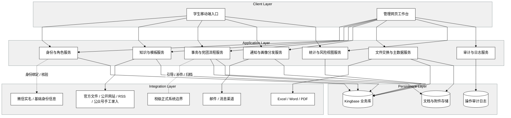

# Software Vision: 信息学院学生综合服务与党团管理平台

**Version:** 1.0 | **Created:** 2026-04-13 | **Last Updated:** 2026-05-12

## Vision

面向信息学院，构建一个以“官方口径自助查询 + 受控智能问答 + 常见事务在线办理 + 党团流程规范留痕 + 定向通知触达 + 学业分析预警”为核心的学院级数字化服务平台。该平台不追求替代校级正式系统，而是聚焦学院高频、规则相对稳定、人工成本高的场景，形成学生可用、老师减负、领导可视、管理员可控的一站式入口。平台将以低并发、强边界、重治理为前提，通过手机端支持学生高频操作，通过网页端支撑管理、审批、导入导出与统计。

## Stakeholders

| Stakeholder | Role | Primary Concern | Influence |
|-------------|------|-----------------|-----------|
| 学生 | 主要终端用户 | 快速查询政策、发起申请、跟踪状态、接收提醒 | High |
| 班团骨干 / 团支书 / 党支部书记 | 协同管理者 | 在职责范围内查看记录、执行提醒、汇总组织工作 | Medium |
| 辅导员 / 班主任 / 学院老师 | 核心业务操作者 | 审批效率、材料完整性、知识维护、通知分发 | High |
| 学院领导 | 管理决策者 | 关键审批、统计汇总、执行情况与风险态势 | High |
| 超级管理员 | 系统运营者 | 角色权限、模板、标签、知识库、日志与流程配置 | High |
| 外部内容提供部门 | 相邻业务方 | 通知与政策信息的准确传递 | Medium |
| 开发与维护团队 | 交付者 | 模块化、可维护性、文档完整性 | Medium |

## Product Overview

### Purpose
把目前分散在微信群、表格、线下跑腿与临时口头答复中的学院事务，收束到统一平台中，让学生在同一入口完成“查什么、怎么办、做到哪一步”的闭环，让老师在同一工作台完成“答什么、审什么、看什么”的闭环。

### In Scope
- 政策知识库、标准答案、受控 AI 匹配答复、官方来源链接与模板下载。
- 党团流程可视化、阶段查询、节点提醒、工作记录与理论自测。
- 请假、盖章、证明、报名、材料提交等常见事务的在线申请、系统内置证明版式 PDF 预览与流转。
- 通知聚合、标签管理、目标人群选择与站内 / 邮件 / 短信推送。
- 学生主数据、模板、业务台账与规则数据的文件交换维护。
- 角色权限、字段可见性、操作日志与审计。
- 学业缺口、风险提示与课程类型级选课建议的弱结论展示。

### Out of Scope
- 直接替代必须在校级系统中生效的正式流程。
- 面向非信息学院或全校的统一开放。
- 学生侧批量导入导出学院级数据。
- 对封闭平台实施非授权抓取。
- 直接给出毕业资格、学分核算终局判断或高风险自动裁决。

### Cross-Reference
系统边界、外部系统与核心组件的抽象视图见 `docs/srs/02-software-glance.md`，本文件在其基础上补充产品定位、特性优先级与高层架构。

## High-Level Features

| Feature | Description | Benefit | Priority |
|---------|-------------|---------|----------|
| 官方知识与 FAQ | 提供政策、流程、资格、材料与官方链接的统一查询入口 | 降低重复答疑，提升学生自助率 | Must-have |
| 受控智能问答 | 基于标准答案、知识条目和官方链接提供关键词匹配或受控 AI 匹配答复 | 在保证口径可控前提下降低人工咨询压力 | Must-have |
| 模板与内容治理 | 管理模板、知识来源、版本、更新时间与失效状态 | 保证内容权威、可维护、可追溯 | Must-have |
| 党团流程跟踪与理论自测 | 展示入党入团阶段、已完成动作、下一节点与提醒，并支持基于题库的理论自测 | 规范党团流程，增强学生自助学习 | Must-have |
| 常见事务申请与审批 | 在线处理请假、盖章、证明、报名、材料提交等事项，并支持系统内置证明版式 PDF 预览 | 减少线下往返，统一状态与材料 | Must-have |
| 流转规则与审计留痕 | 支持驳回、撤回、重提、重批以及日志追踪 | 强化问责、复盘与治理能力 | Must-have |
| 官方通知汇聚与标签化分发 | 手工录入公众号通知或受控抓取公开 URL/RSS 官方通知，按年级、专业、身份等条件选择目标群体，并通过站内 / 邮件 / 短信发送 | 提升通知精准度，减少信息噪音 | Must-have |
| 文件交换与主数据维护 | 通过 Excel/Word/PDF 管理基础数据、模板和业务台账 | 在接口受限条件下维持业务连续性 | Must-have |
| 统计与学业分析视图 | 输出工作量、进度、触达统计及弱结论学业风险提示和课程类型建议 | 为领导和学生提供决策辅助 | Must-have |

## Environment and Constraints

### Deployment Environment
- 学生侧优先适配移动端轻量场景，可落地为微信小程序或等价移动 Web 入口。
- 管理侧优先采用网页端，支持审批、统计、导入导出和配置操作。
- 一期默认按学院级部署与运营，不预设全校级多租户能力。

### Technical Constraints
- 核心数据库需兼容人大金仓（Kingbase）。
- 账号体系需与微信实名或学院掌握的基础身份信息保持一致。
- 由于无法直接对接“微人大”接口，文件交换与人工维护不是补充功能，而是基础能力。
- PDF/图片识别精度低于 Excel，必须通过标准模板与人工修正降低误差。

### Integration Requirements
- 接入官方文件、公开网站、RSS 与公众号等内容来源；公众号默认手工导入，自动抓取仅限公开 URL/RSS。
- 支持与站内消息、邮件和短信渠道协作完成提醒触达，短信启用方式可由部署配置控制。
- 保留跳转、说明、补件或归档能力，以衔接校级正式系统边界。

### Security Requirements
- 敏感字段需要加密存储、最小授权展示和访问审计。
- 管理员侧的配置、导出、审批等关键操作都必须可留痕。
- 问答场景不得直接返回高敏感个人字段，应优先给出办理路径或转人工提示。

### Performance Requirements
- 系统设计需支持并发用户数不少于 `50` 人，吞吐能力不低于 `50 TPS`。
- 在 `50` 并发用户基准下，`95%` 的学生侧核心事务（如政策查询、党团进度查看、申请提交）响应时间应小于 `3` 秒。
- 在 `50` 并发用户基准下，`95%` 的管理端核心操作（如审批列表加载、通知筛选、日志查询）响应时间应小于 `5` 秒。
- `100` 条标准 `Excel` 数据导入应在 `60` 秒内完成成功提交或整批回滚；面向 `200` 名用户的单批通知分发应在 `30` 秒内完成。

### Compatibility Requirements
- 学生高频功能需要兼容手机端常见浏览与操作环境。
- 管理端需要兼容主流桌面浏览器与常见办公文件格式。

## High-Level Architecture

### Architecture Notes
- 架构以“统一身份与角色、统一业务库、统一审计日志”为骨架，避免各模块各自维护权限和记录。
- 内容治理、流程管理、数据交换、通知分发是四条主业务链，学生与老师分别通过不同端口接入相同核心能力。
- 与校级正式系统保持弱耦合，只在必要处提供说明、链接、归档或补件，不把校级效力错误映射到学院平台。
- 学业风险视图被定位为高层辅助能力，输入数据和责任边界必须始终可解释。
- “知识库、流程、审批、通知、审计”五个闭环是技术拆解主线，不代表范围删减；受控智能问答、理论自测、通知汇聚、证明预览和课程建议均属于正式需求范围，并分别挂接在对应服务中实现。
