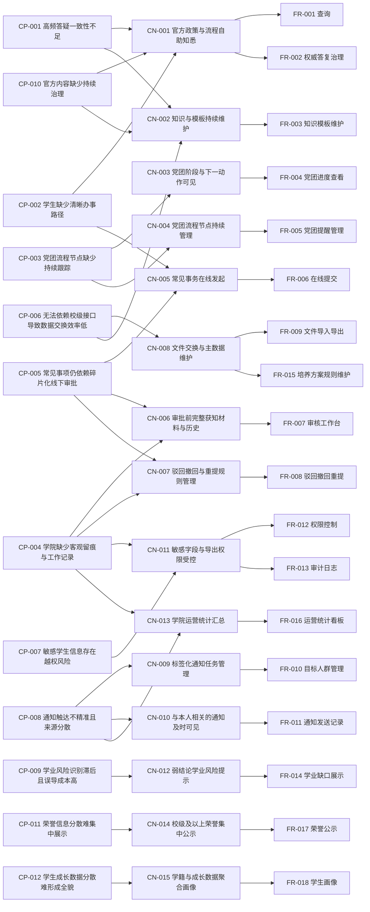

# Traceability Matrix

**Version:** 1.2 | **Created:** 2026-04-13 | **Last Updated:** 2026-05-02

## End-to-End Traceability

## CP → CN Mapping

| Customer Problem | Related Customer Needs | Coverage |
|------------------|------------------------|----------|
| CP-001 高频答疑一致性不足 | CN-001, CN-002 | Complete |
| CP-002 学生缺少清晰办事路径 | CN-001, CN-005 | Complete |
| CP-003 党团流程节点缺少持续跟踪 | CN-003, CN-004 | Complete |
| CP-004 学院缺少客观留痕与工作记录 | CN-004, CN-006, CN-007, CN-011, CN-013 | Complete |
| CP-005 常见事项仍依赖碎片化线下审批 | CN-005, CN-006, CN-007 | Complete |
| CP-006 无法依赖校级接口导致数据交换效率低 | CN-002, CN-008 | Complete |
| CP-007 敏感学生信息存在越权风险 | CN-011 | Complete |
| CP-008 通知触达不精准且来源分散 | CN-009, CN-010, CN-013 | Complete |
| CP-009 学业风险识别滞后且误导成本高 | CN-012 | Complete |
| CP-010 官方内容缺少持续治理 | CN-001, CN-002 | Complete |
| CP-011 荣誉信息分散难集中展示 | CN-014 | Complete |
| CP-012 学生成长数据分散难形成全貌 | CN-015 | Complete |

## CN → FR Mapping

| Customer Need | Related FRs | Coverage |
|---------------|-------------|----------|
| CN-001 官方政策与流程自助知悉 | FR-001, FR-002 | Complete |
| CN-002 知识与模板的持续维护 | FR-003 | Complete |
| CN-003 党团阶段与下一动作可见 | FR-004 | Complete |
| CN-004 党团流程节点持续管理 | FR-005 | Complete |
| CN-005 常见事务在线发起 | FR-006 | Complete |
| CN-006 审批前完整获知材料与历史 | FR-007 | Complete |
| CN-007 驳回、撤回与重提的规则管理 | FR-008 | Complete |
| CN-008 文件交换与主数据维护 | FR-009, FR-015 | Complete |
| CN-009 标签化通知任务管理 | FR-010 | Complete |
| CN-010 与本人相关的通知及时可见 | FR-011 | Complete |
| CN-011 敏感字段与导出权限受控 | FR-012, FR-013 | Complete |
| CN-012 弱结论学业风险提示 | FR-014 | Complete |
| CN-013 学院运营统计汇总 | FR-016 | Complete |
| CN-014 校级及以上荣誉集中公示 | FR-017 | Complete |
| CN-015 学籍与成长数据聚合画像 | FR-018 | Complete |

## NFR Traceability

| NFR | Traces To CN | Applies To FRs |
|-----|--------------|----------------|
| NFR-001 敏感数据安全 | CN-011, CN-015 | FR-006, FR-009, FR-012, FR-013, FR-018 |
| NFR-002 审计留存与可追溯性 | CN-007, CN-011 | FR-008, FR-012, FR-013, FR-016, FR-017, FR-018 |
| NFR-003 常见操作响应时间 | CN-001, CN-014 | FR-001, FR-004, FR-007, FR-011, FR-016, FR-017 |
| NFR-004 事务一致性与数据可靠性 | CN-008 | FR-005, FR-006, FR-008, FR-009, FR-014, FR-015, FR-017 |
| NFR-005 学生与老师的操作易用性 | CN-005, CN-015 | FR-006, FR-007, FR-008, FR-018 |

## Zigzag Validation Report

### Completeness Check

| Check Item | Result | Notes |
|------------|--------|-------|
| Every CP has at least one CN | ✅ | 12 / 12 traced |
| Every CN has at least one FR | ✅ | 15 / 15 traced |
| Every FR traces to a CN | ✅ | 18 / 18 traced |
| Every FR traces to a CP | ✅ | 18 / 18 traced through CN |
| Every NFR traces to a CN | ✅ | 5 / 5 traced |
| Orphan CPs | ✅ None | — |
| Orphan CNs | ✅ None | — |
| Orphan FRs | ✅ None | — |

### Independence Review

| Area | Observation | Action |
|------|-------------|--------|
| CN-001 | 由 FR-001 与 FR-002 分别承接查询能力与权威边界 | Accept |
| CN-008 | 由 FR-009 与 FR-015 共同承接文件交换与规则数据维护 | Accept |
| CN-011 | 由 FR-012 与 FR-013 分别承接权限控制与审计能力 | Accept |
| 学业模块 | FR-014 依赖 FR-015 提供规则基础 | 作为正式范围纳入实施，但以弱结论和样例数据兜底避免越界承诺 |
| 展示与画像 | FR-017（荣誉公示）与 FR-018（画像）共用敏感字段治理与 consent 机制 | Accept；FR-018 额外承接账号生命周期状态机（v1.5 补充） |

### Traceability Gap Analysis

| Gap Type | Item | Impact | Resolution |
|----------|------|--------|------------|
| None | — | 当前 `CP -> CN -> FR -> NFR` 文档追溯链已闭合 | 继续以当前链路作为后续验收与交付依据 |

### Residual Business Decisions

| Gate Type | Item | Impact | Current Status |
|-----------|------|--------|----------------|
| Pending Business Decision | 校级正式流程与学院平台边界（Q-02~Q-06） | 影响部分事务是否仅做指引/归档 | 已通过当前一期“引导/归档/线下办理提示”实现收口，最终清单仍需业务确认 |
| Pending Data Decision | 培养方案结构化数据来源（Q-08） | 影响 FR-014 / FR-015 的真实样例与规则验证 | 已按弱结论与规则模板完成一期实现，真实数据源仍待补充 |

### Phase Status Alignment

| Phase | Current Status | Evidence |
|-------|----------------|----------|
| S4 权限、审计、性能、数据库兼容 | `[x]` 已闭合 | 隔离 `54323` Kingbase gate 已完成迁移、seed、`44` 条 S4 集成回归与导入 benchmark；字段级权限、审计链路、索引迁移、性能基线和 Kingbase 兼容回归均已有脚本、环境与结果证据 |
| S5 文档与交付闭环 | `[x]` 已闭合 | 追踪矩阵、验收走查和 `v1.6` 正式交付件已收口；`scripts/srs/v1_6/run_v16_delivery_gate.ps1 -Force` 已生成 `v1.6`、`v1.6-emf`、`v1.6-emf-inkscape` 三组 `docx / pdf` 共 `6` 个正式交付件，并完成页数与嵌入资源一致性检查 |
| S6 前端体验增量优化 | `ACTIVE` / 已完成多轮增量 | 当前主计划目标为在 `S1 ~ S5` 已闭合基础上继续推进 `web + miniapp` 体验优化；截至 `2026-04-28`，`S6.1 ~ S6.21` 已按登记细化完成并通过双端类型检查、构建或微信小程序出包验证 |

## Validation Conclusion

- 当前 CP → CN → FR 链条在 **FR-001 ~ FR-018** 范围内完整，无孤儿项。
- 一期实施主线以**六个核心闭环**组织（知识库 / 流程 / 审批 / 通知 / 审计 / 展示与画像），`FR-001 ~ FR-018` 均属于正式范围。
- `FR-014` / `FR-015` 与学业模块相关，应通过真实数据或甲方确认的样例数据进入实施与验收计划。
- `FR-017` / `FR-018` 为 v1.5 新增：展示与画像闭环已纳入范围，`FR-018` 并承接账号生命周期全局状态机（见 `docs/notes/fix.md` 第 1 条）。
- `CP-011 / CP-012` 与 `CN-014 / CN-015` 的上游文档已补齐，追溯链条不再存在“待上游补充”残留。
- `S4` 的治理、性能与 Kingbase 验证门已于 `2026-04-22` 关闭；`S5` 正式交付链也已完成，相关状态已统一改为完成态。
- 当前 `S6` 属于已闭合交付基线之上的前端体验增量优化，不改变本矩阵的 `CP -> CN -> FR -> NFR` 追溯结论。
