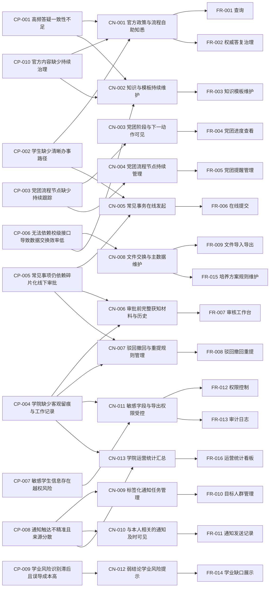

# Traceability Matrix

**Version:** 1.0 | **Created:** 2026-04-13 | **Last Updated:** 2026-04-13

## End-to-End Traceability

## CP → CN Mapping

| Customer Problem | Related Customer Needs | Coverage |
|------------------|------------------------|----------|
| CP-001 高频答疑一致性不足 | CN-001, CN-002 | Complete |
| CP-002 学生缺少清晰办事路径 | CN-001, CN-005 | Complete |
| CP-003 党团流程节点缺少持续跟踪 | CN-003, CN-004 | Complete |
| CP-004 学院缺少客观留痕与工作记录 | CN-004, CN-006, CN-007, CN-011, CN-013 | Complete |
| CP-005 常见事项仍依赖碎片化线下审批 | CN-005, CN-006, CN-007 | Complete |
| CP-006 无法依赖校级接口导致数据交换效率低 | CN-002, CN-008 | Complete |
| CP-007 敏感学生信息存在越权风险 | CN-011 | Complete |
| CP-008 通知触达不精准且来源分散 | CN-009, CN-010, CN-013 | Complete |
| CP-009 学业风险识别滞后且误导成本高 | CN-012 | Complete |
| CP-010 官方内容缺少持续治理 | CN-001, CN-002 | Complete |

## CN → FR Mapping

| Customer Need | Related FRs | Coverage |
|---------------|-------------|----------|
| CN-001 官方政策与流程自助知悉 | FR-001, FR-002 | Complete |
| CN-002 知识与模板的持续维护 | FR-003 | Complete |
| CN-003 党团阶段与下一动作可见 | FR-004 | Complete |
| CN-004 党团流程节点持续管理 | FR-005 | Complete |
| CN-005 常见事务在线发起 | FR-006 | Complete |
| CN-006 审批前完整获知材料与历史 | FR-007 | Complete |
| CN-007 驳回、撤回与重提的规则管理 | FR-008 | Complete |
| CN-008 文件交换与主数据维护 | FR-009, FR-015 | Complete |
| CN-009 标签化通知任务管理 | FR-010 | Complete |
| CN-010 与本人相关的通知及时可见 | FR-011 | Complete |
| CN-011 敏感字段与导出权限受控 | FR-012, FR-013 | Complete |
| CN-012 弱结论学业风险提示 | FR-014 | Complete |
| CN-013 学院运营统计汇总 | FR-016 | Complete |

## NFR Traceability

| NFR | Traces To CN | Applies To FRs |
|-----|--------------|----------------|
| NFR-001 敏感数据安全 | CN-011 | FR-006, FR-009, FR-012, FR-013 |
| NFR-002 审计留存与可追溯性 | CN-007 | FR-008, FR-012, FR-013, FR-016 |
| NFR-003 常见操作响应时间 | CN-001 | FR-001, FR-004, FR-007, FR-011, FR-016 |
| NFR-004 事务一致性与数据可靠性 | CN-008 | FR-005, FR-006, FR-008, FR-009, FR-014, FR-015 |
| NFR-005 学生与老师的操作易用性 | CN-005 | FR-006, FR-007, FR-008 |

## Zigzag Validation Report

### Completeness Check

| Check Item | Result | Notes |
|------------|--------|-------|
| Every CP has at least one CN | ✅ | 10 / 10 covered |
| Every CN has at least one FR | ✅ | 13 / 13 covered |
| Every FR traces to a CN | ✅ | 16 / 16 traced |
| Every FR traces to a CP | ✅ | 16 / 16 traced through CN and direct file traceability |
| Every NFR traces to a CN | ✅ | 5 / 5 traced |
| Orphan CPs | ✅ None | — |
| Orphan CNs | ✅ None | — |
| Orphan FRs | ✅ None | — |

### Independence Review

| Area | Observation | Action |
|------|-------------|--------|
| CN-001 | 由 FR-001 与 FR-002 分别承接查询能力与权威边界 | Accept |
| CN-008 | 由 FR-009 与 FR-015 共同承接文件交换与规则数据维护 | Accept |
| CN-011 | 由 FR-012 与 FR-013 分别承接权限控制与审计能力 | Accept |
| 学业模块 | FR-014 依赖 FR-015 提供规则基础 | 作为正式范围纳入实施，但以弱结论和样例数据兜底避免越界承诺 |

### Gap Analysis

| Gap Type | Item | Impact | Resolution |
|----------|------|--------|------------|
| Pending Business Decision | 校级正式流程与学院平台边界 | 影响部分事务是否仅做指引/归档 | 在详细设计前与业务方确认流程清单 |
| Pending Data Decision | 培养方案结构化数据来源 | 影响 FR-014 / FR-015 可落地性 | 若真实数据暂不可得，则以甲方确认的样例数据、规则模板和弱结论模式完成 FR-014 / FR-015 的一期交付与验收 |
| Pending Governance Decision | 字段级权限矩阵 | 影响 FR-012 配置明细 | 在实施前形成角色-字段矩阵 |

## Validation Conclusion

- 当前 CP → CN → FR 链条完整，无孤儿项。
- 一期实施主线以五个核心闭环组织，但 `FR-001` 至 `FR-016` 均属于正式范围。
- `FR-014`、`FR-015` 与学业模块相关，应通过真实数据或甲方确认的样例数据进入实施与验收计划。
