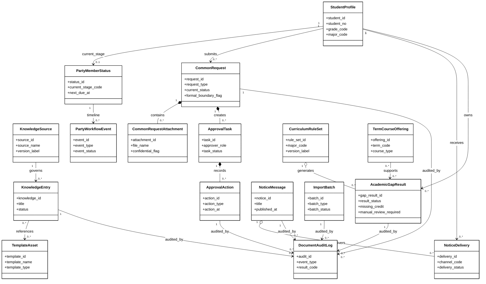
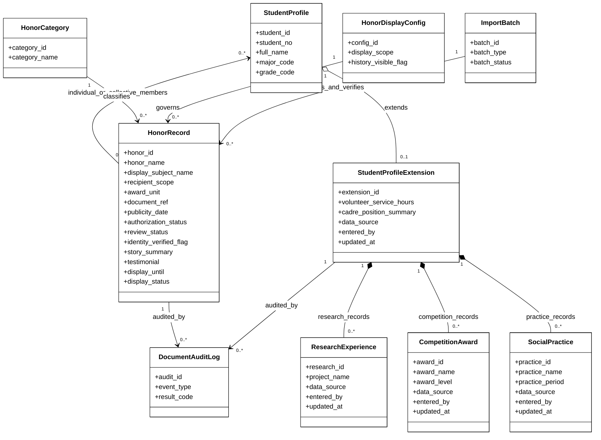
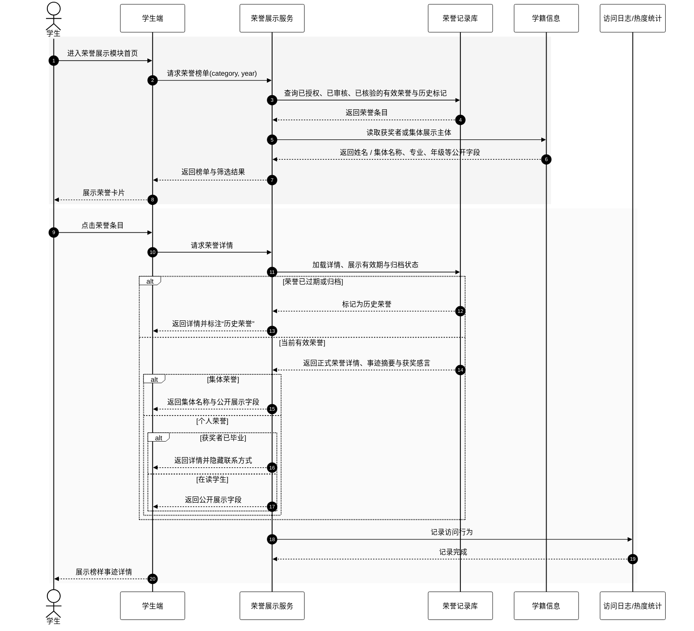
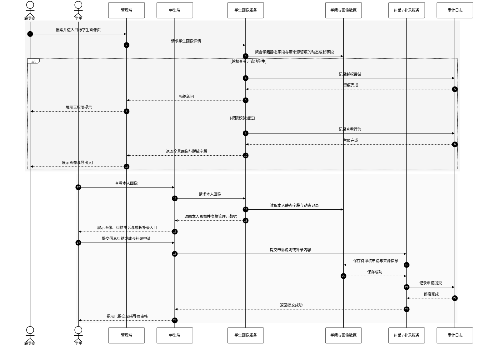

# Analysis Model

**Feature**: `specs/001-student-service-platform/spec.md`  
**Created**: 2026-04-13  
**Updated**: 2026-04-15  
**Purpose**: 为传统软件需求规格说明书补充七模块核心业务分析类图与新增模块代表性时序图

## 1. 核心业务分析类图

## 2. 奖励荣誉与学生画像扩展类图

## 3. 时序图：浏览荣誉榜单并查看榜样事迹

## 4. 时序图：查看学生画像与提交纠错 / 成长补录申请

## 5. 模型说明

- 本次将分析模型拆分为“核心业务分析类图”和“奖励荣誉与学生画像扩展类图”，避免单图横向过宽导致 Word 中不可读。
- `HonorRecord / HonorCategory / HonorDisplayConfig` 仅表达正式荣誉、个人/集体展示主体、授权审核、学籍核验、归档与展示边界，不扩展到文档未定义的评分或推荐逻辑。
- `StudentProfileExtension / ResearchExperience / CompetitionAward / SocialPractice` 仅表达成长数据聚合、来源留痕、学生补录后审核入库和权限展示，不表达自动评分、排名或评价结论。
- 原有知识问答、党团流程、通知推送、电子证明审批和学业分析的动态图继续沿用现有图稿；本文件补充一张扩展类图和两张新增模块代表性时序图以完成七模块覆盖。
