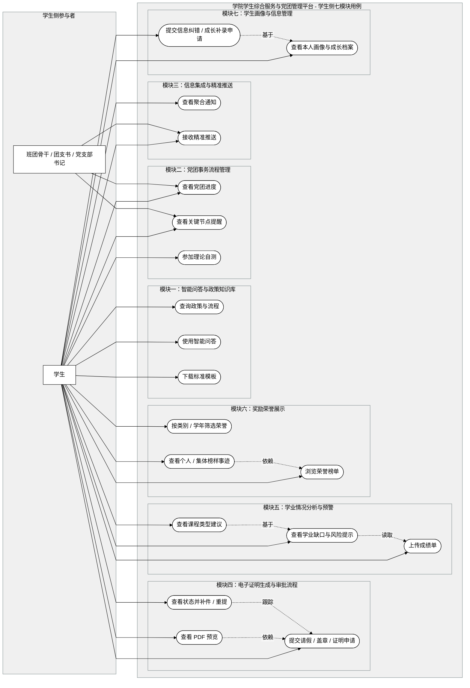
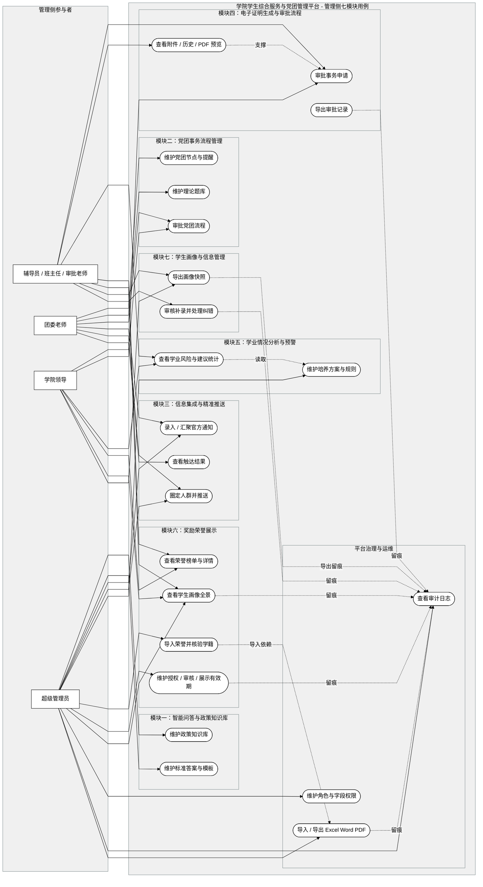

# Use Case Model

**Feature**: `specs/001-student-service-platform/spec.md`  
**Created**: 2026-04-13  
**Updated**: 2026-04-15  
**Purpose**: 为传统软件需求规格说明书补充七模块全局用例视图与代表性用例事件流

## 1. 全局用例图

> Mermaid 当前无原生 `usecaseDiagram` 语法，以下使用 `flowchart` 表达等价的全局用例图。

### 1.1 学生侧全局用例图

### 1.2 管理侧全局用例图

## 2. 核心用例：开具电子证明

### 2.1 用例描述表

| 项目 | 内容 |
|------|------|
| 用例名称 | 开具电子证明 |
| 主要参与者 | 学生 |
| 次要参与者 | 班主任 / 审批老师、团委老师、学院授权出件人 |
| 触发条件 | 学生需要提交在读、身份或党团相关证明申请 |
| 前置条件 | 学生完成身份认证并进入本人业务范围；证明模板、知识说明和审批角色已配置；若该证明属于学院可处理范围，系统已配置学院审批链 |
| 后置条件 | 生成可追踪的证明申请记录；审批意见、状态变化和附件信息全部留痕；通过后生成出件结果、预览文件或线下出件通知 |
| 相关需求 | [FR-006][FR-007][FR-008] |

### 2.2 主事件流

| 步骤 | 参与者 | 系统响应 |
|------|--------|----------|
| 1 | 学生 | 进入“证明申请”页面 |
| 2 | 系统 | 展示证明类型、用途说明、必填字段、可选模板和附件要求 |
| 3 | 学生 | 填写用途、补充说明，并上传已有附件或选择标准模板 |
| 4 | 系统 | 校验必填项、附件规则和权限范围，生成证明申请单 |
| 5 | 系统 | 将申请状态设置为“待审核”，并创建审批任务 |
| 6 | 班主任 / 审批老师 | 进入审核工作台，查看申请详情、用途说明、学生基础信息和附件内容 |
| 7 | 审批人 | 填写意见并执行“通过”或“驳回”操作 |
| 8 | 系统 | 若通过，则更新状态为“已审核”或“待出件”，并通知下一处理人或学生 |
| 9 | 系统 | 若最终完成出件，则记录出件时间、出件人和预览文件引用，学生可查看结果或下载预览 |

### 2.3 异常 / 备选分支

| 编号 | 场景 | 处理方式 |
|------|------|----------|
| A1 | 附件缺失或内容不合规 | 审批人驳回并填写补充说明；系统保存驳回意见和表单快照；学生在原申请基础上修改后重提 |
| A2 | 证明必须走校级正式链路 | 系统展示“学院平台仅作说明 / 预检 / 归档，不代表正式生效”的边界提示，并引导至正式渠道 |
| A3 | 涉密内容不适合线上出件 | 审批人标记“转线下处理”；系统保留申请单和审批记录，但不生成在线可下载文件 |

## 3. 核心用例：党团流程审批

### 3.1 用例描述表

| 项目 | 内容 |
|------|------|
| 用例名称 | 党团流程审批 |
| 主要参与者 | 团支书 / 党支部书记、团委老师 |
| 次要参与者 | 学生、学院领导（可选终审） |
| 触发条件 | 学生或组织角色发起某个党团阶段申请，或进入待审批节点 |
| 前置条件 | 学生已存在有效党团基础档案或待建档申请；流程节点、提醒规则和审批角色已配置；当前业务节点属于学院可维护范围 |
| 后置条件 | 学生党团阶段、节点事件和审批意见被正确更新；下一节点提醒规则自动调整；审批动作和顺序写入审计记录 |
| 相关需求 | [FR-004][FR-005][FR-007][FR-008] |

### 3.2 主事件流

| 步骤 | 参与者 | 系统响应 |
|------|--------|----------|
| 1 | 学生 / 组织角色 | 发起某个党团阶段申请，或进入待审批节点 |
| 2 | 系统 | 根据学生当前阶段和节点定义生成待办事项 |
| 3 | 团支书 / 党支部书记 | 查看该学生当前阶段、历史节点和所需材料 |
| 4 | 初审角色 | 核验材料完整性、时间节点和组织侧条件 |
| 5 | 系统 | 记录初审结果，并将任务流转给团委老师或下一审批角色 |
| 6 | 团委老师 | 查看学生阶段信息、前置节点、材料和初审意见 |
| 7 | 团委老师 | 执行通过、驳回或转补充材料操作 |
| 8 | 系统 | 若通过，则更新 `party_member_status` 为新阶段，并生成后续提醒计划 |
| 9 | 系统 | 若流程配置要求院级确认，则继续创建学院领导待办；否则流程结束 |
| 10 | 学生 | 在个人端查看新的阶段状态、已完成动作和下一节点要求 |

### 3.3 异常 / 备选分支

| 编号 | 场景 | 处理方式 |
|------|------|----------|
| B1 | 材料不完整或时间条件不满足 | 审批人执行驳回或补件操作；系统记录原因并等待学生补全材料后重新进入节点 |
| B2 | 审批链存在学院领导终审 | 团委老师通过后，系统创建学院领导审批任务；领导通过或退回后决定是否进入下一阶段 |
| B3 | 节点到期未处理 | 系统自动触发提醒；若超期仍未处理，则标记异常并在管理端汇总显示 |
| B4 | 学生查看进度时权限发生变化 | 系统仅更新当前可见范围，不回溯修改既有历史审批记录 |

## 4. 代表用例：浏览荣誉榜单并查看榜样事迹

### 4.1 用例描述表

| 项目 | 内容 |
|------|------|
| 用例名称 | 浏览荣誉榜单并查看榜样事迹 |
| 主要参与者 | 学生 |
| 次要参与者 | 辅导员 / 管理员 |
| 触发条件 | 学生进入奖励荣誉展示模块 |
| 前置条件 | 管理员已导入或录入经学生本人授权（如适用）且经学院审核通过的校级及以上正式荣誉数据；荣誉条目已关联学生学籍信息或集体主体信息并完成身份核验，且位于公示有效期内；学生已登录系统 |
| 后置条件 | 学生成功查看荣誉榜单及榜样事迹详情；系统记录访问行为用于展示热度统计 |
| 相关需求 | `FR-017` |

### 4.2 主事件流

| 步骤 | 参与者 | 系统响应 |
|------|--------|----------|
| 1 | 学生 | 进入荣誉展示模块首页 |
| 2 | 系统 | 展示荣誉榜单，支持按类别和学年筛选 |
| 3 | 学生 | 点击某一荣誉条目 |
| 4 | 系统 | 展示获奖者或集体基本信息、荣誉名称、授予单位、事迹摘要和获奖感言（如有） |
| 5 | 学生 | 浏览完毕，返回或继续查看 |

### 4.3 异常 / 备选分支

| 编号 | 场景 | 处理方式 |
|------|------|----------|
| C1 | 荣誉已过期或归档 | 标注“历史荣誉”，不再主动推送 |
| C2 | 获奖者已毕业 | 保留荣誉展示，隐藏个人联系方式 |

## 5. 代表用例：查看学生综合画像与成长档案

### 5.1 用例描述表

| 项目 | 内容 |
|------|------|
| 用例名称 | 查看学生综合画像与成长档案 |
| 主要参与者 | 辅导员 |
| 次要参与者 | 学生 / 学院领导 |
| 触发条件 | 辅导员需要查看某名学生的综合画像 |
| 前置条件 | 学籍信息已同步，扩展字段已录入；辅导员具备所带班级查看权限 |
| 后置条件 | 辅导员完成画像查阅；系统记录操作日志；学生本人可通过独立入口发起信息纠错或成长补录申请 |
| 相关需求 | `FR-018` |

### 5.2 主事件流

| 步骤 | 参与者 | 系统响应 |
|------|--------|----------|
| 1 | 辅导员 | 搜索并进入目标学生画像页 |
| 2 | 系统 | 聚合展示学籍静态字段与科研、竞赛、实践等动态字段 |
| 3 | 辅导员 | 浏览各维度信息，敏感字段默认脱敏 |
| 4 | 辅导员 | 结束查看，日志留痕 |
| 5 | 学生 | 在本人端查看画像并进入“信息纠错 / 成长补录”入口 |
| 6 | 系统 | 隐藏管理元数据，记录申诉说明或补录内容并提交至辅导员审核处理 |

### 5.3 异常 / 备选分支

| 编号 | 场景 | 处理方式 |
|------|------|----------|
| D1 | 越权查看非管辖学生 | 拒绝访问并记录越权尝试 |
| D2 | 学生本人查看画像或提交补录申请 | 隐藏管理元数据，提供纠错申诉与成长补录入口 |
